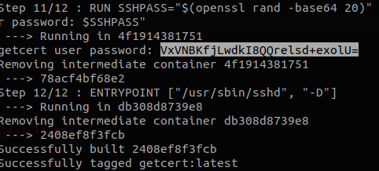

# getCert CE - SSL Certificates for BMC Discovery
Copyright 2021 Traversys Limited

|     |     |
| --- | --- |
| License | Apache License 2.0 |
| Version | 1.7.0 |

Polls devices on a given IP range for SSL certificate details.

## Installation

### Requires
* Docker

### Quickstart
1. Install and configure Docker
2. Run `docker build --tag getcert -f dockerbuild/Dockerfile .`
3. To use run `docker run -t -d -p 2222:22 --name getCert -v ${PWD}:/usr/dev getcert:latest`
4. To access the shell: `docker exec -it getCert /bin/bash`

### SSH Access
1. Make a note of the password generated by the build script
   
2. Run `docker inspect getCert | grep 'IPAddress'`
3. SSH from Host: `ssh getcert@<ip address>`
4. SSH from outside Host: `ssh getcert@<ip address> -p 2222`

### Production
1. Install and configure Docker
2. Run `docker run -t -d -p 2222:22 --name getCert -v ${PWD}:/usr/dev getcert:latest`
3. To stop the container: `docker stop <container id>`

**NOTE** When you exit the container it will stop running. To get back in (and start) the container run `docker start <container id>`

### Deployment (Old)
1. Copy the the **traversys_getcert.run** binary to the Discvory Appliance (recommended /usr/tideway/data/customer)
2. Change permissions: `chomd 755 traversys_getcert.run`
3. Run the installation: `./traversys_getcert.run`
4. Follow on-screen instructions.
5. Update configuration options in config.ini file
6. Run cron.sh to setup the cronjob automatically

**WARNING** SSL Certificate discovery can be intensive, especially on large subnets. Therefore it is advisable to schedule a weekly cronjob, unless you are working with a small list of IPs.

### Usage

By default, the script will run a query on the appliance for a list of IP addresses or subnets.
The certificate discovery will commence in the background and export details to an encrypted data file.

There are 3 modes you can use and are set in the config file:

1. Scan for SSL Certificates on the test ips/subnet string
2. Scan for a list of ips/subnets in the specified input file
3. Run the query (appliance login needed) to export a list of ips/subnets

You must enable appliance self-scanning in order to trigger discovery of the data file.

You can set cron by specifying the schedule syntax in the config file then running cron.sh at any time.

Documentation: https://traversys.github.io/getCert_CE/