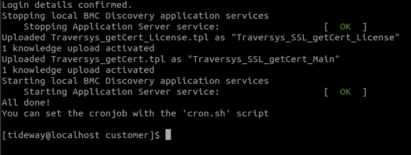
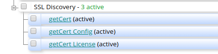
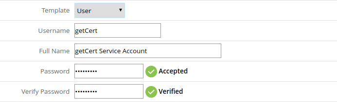
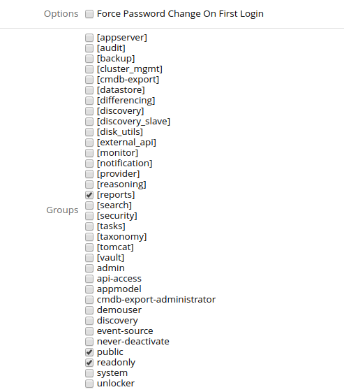
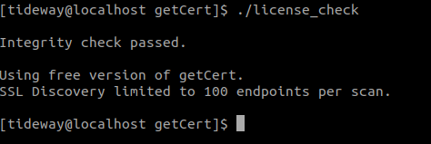
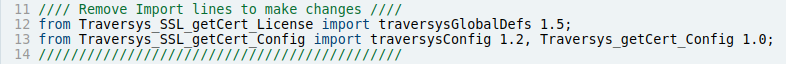
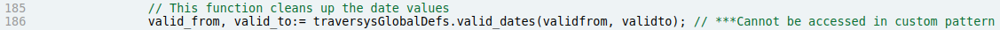
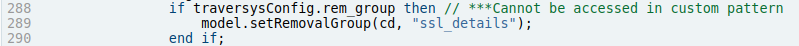
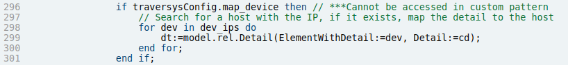
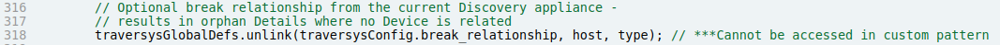

# getCert 1.6 for BMC Discovery

You can contact Traversys via email to teams@traversys.io or visiting our website https://traversys.io. From this website you can obtain information about our company, products and services.

## License Key Information
If you have purchased a license key and have any questions, you can contact us for support using the details above, with your licensed email address.

## Tested Versions
getCert 1.6 has been tested on the following versions of BMC Discovery (RHEL/CentOS). Other versions may be compatible but have not been tested.

* 11.x
* 12.0

# Release Notes

| Version | Summary | Known Issues | Bug Fixes |
| :-----: | ------- | ------------ | --------- |
| 1.1.0   | Alpha release | | |
| 1.2.0   | Beta release | | |
| 1.3.0   | Updated ciphers and timeout functions. | | Using older version of NMAP to maintain compatibility with ADDM v10.x |
| 1.4.0   | Updated config file using ConfigParser. Replaces the ssl_capture shell script. | | |
| 1.5.0   | Added license key capability for 100 certificate limit. | | |
| 1.6.0   | Community Edition | | Open sourced - no license limits. |

# Overview

Traversys getCert is an extension to on-premise BMC Discovery. It operates independently of Discovery scans to non-invasively collect information about externally facing SSL certificates (accessible via open web/application ports) against your data center infrastructure.

The data that is collected is then in turn 'discovered' via scanning the getCert host (a Discovery Appliance), and building a list of certificate Detail nodes. If certificate hosting devices are also discovered, getCert will automatically attempt to map these via IP Address and/or Common Name of the discovered SSL certificate.

getCert is highly configurable, with the option to scan subnets, websites, DNS hostnames or IP addresses, and the discovered data can be added to the model in different ways (by default creating a Detail node).

~~Note: The free version of getCert allows the ability to scan 100 endpoints per scan. These endpoints will be scanned in a randomised order and SSL Certificates will only be generated for those in scanned range.~~

# Installation

## Dependencies

getCert does not require any external dependencies as it will use the same packages and libraries of the host Discovery Appliance RHEL or CentOS system.

If you attempt to deploy getCert on a stand-alone server, you will find that it fails integrity checks, as the scripts depend upon the loaded TPL patterns. If you require a stand-alone version of getCert - please contact Traversys about professional support.

## Installation Steps

1. Extract the the `traversys_getcert.run` binary from the zip file and deploy it to a suitable location on your appliance e.g. `/usr/tideway/data/customer`
2. You may need to make the binary executable, if this is the case, as the tideway user, enter the following command e.g.
```console
$ chmod +x /usr/tideway/data/customer/traversys_getcert.run
```
3. From the binary location, run the command as follows:
```console
$ cd /usr/tideway/data/customer
$ ./traversys_getcert.run
```
4. The installation script displays a warning that it will halt the application service whilst installing. In order to continue, type "Y":\

5. The script will then prompt you to enter your system user login and password. These will not be stored, and only used to initiate interaction with Discovery:\

6. The installation script will now stop the application services and deploy the getCert basic license and TPL files.\

7. The script has now deployed three patterns modules;
   1. getCert_License
   2. getCert_Config
   3. getCert

You are free to browse the contents of these TPL files to see how they work. However you must not attempt to alter getCert_License or getCert_Config in any way or it will cause the integrity check to fail and you will have to reinstall.
You can create a custom pattern to replace getCert - however you will need to remove or modify import dependencies which are marked in the file with asterisks `***`.



Continue the steps below to create a reporting user and configure getCert for scanning.

## Create a Reporting User

getCert requires access to Discovery to verify integrity of files and export subnet lists (if you choose this option). Therefore an appliance login must be stored in a plain-text configuration file on the appliance CLI.

Your tideway credential will already give you system level access to all the appliance components - including the ability to change the system user password. However for peace of mind, you can optionally create a 'reporting only' user in the Discovery UI to be used by getCert.

8. Log into Discovery and navigate to Administration (cog) > Users
9. Click on Add…
10. Input a custom Username, Full Name, and Password\

11. Uncheck Force __Password Change On First Login__
12. Check the groups __public__, __readonly__ and __[reports]__\

13. Click __Apply__

# Configure getCert

Follow the steps below to configure getCert for scanning.

1. Change to the newly created directory:
```console
$ cd Traversys/getCert/
```
2. Open up `config.ini` for editing, using vi or nano:
```console
$ vi config.ini
```
```ini
[ENV]
root = /usr/tideway/data/customer/Traversys/getCert
temp = %(root)s/temp
log = %(temp)s/ssl-out.log
capture = %(temp)s/ssl-out.xml
iplist = %(temp)s/ips

[MODE]
mode = 1

[TEST_SUBNET]
testsubnet = 192.168.1.0/24

[LIST_OF_IPS]
file = sample_input.txt

[DISCO_QUERY]
query = "search DiscoveryAccess where _last_marker show endpoint"

[LOGIN]
discouser = system
discopass = system

[CRON]
cron = "0 1 * * 6"

[TIMEOUT]
timeout = 3m

[PORTS]
ports = 261,443,448,465,563,587,614,636,989,990,992,993,994,995,2083,2087,2089,2096,2222,8443,8080,8880
```

### Configuration

The following table details the configuration for environment.

| Parameters | Description |
| ---------- | ----------- |
| root       | This is the root path of the getCert application files.<br>If you move the directory you must change this path. |
| temp       | This is the temporary directory that capture files are stored in. |
| log        | This is the location of the log file. |
| capture    |This is the name of the capture file. |
| ip list    | This is the temporary list of IPs curated from the input option. |

The following table details the configuration options.

| Option      | Parameters | Description |
| :---------: | ---------- | ----------- |
| MODE        | mode       | This is the mode that getCert will use for scanning. There are 3 options:<br>1 - Use the test subnet specified in the config file<br>2 - Use an input file<br>3 - Run a query to extract a list of targets from Discovery.<br>You can supply individual IP addresses, subnets (using CIDR syntax), websites or hostnames (if DNS is configured). |
| TEST_SUBNET | testsubnet | This is an option for testing getCert - you can input any endpoint here. |
| LIST_OF_IPS | file       | This is the name of the input file where you can specify a list of IPs, subnets, host or domain names.<br>The following syntax examples can be used:<br>192.168.1.100><br>192.168.1.1-100<br>192.168.1.0/28 |
| DISCO_QUERY | query     | Here you can specify a query to be run in Discovery. You must ensure that the query outputs only a list of IPs, subnets or hostnames and no other attributes.<br>This option requires the Discovery login user to be set. |
| LOGIN       | discouser | This is a user that can generate read-only reports. If you set a reporting user in the steps above, you can enter it here.<<br>Do not use any quotation marks to surround the username.<br>Escape characters using backslash e.g.: `\!` |
| CRON        | cron      | This is the crontab settings to be used by the cron script. It follows standard crontab syntax.<br>__The default schedule is Every Saturday at 1AM__<br>It is recommended for large IP ranges (10,000+), that you run once a week - the certificate scan can take many hours to complete. |
| TIMEOUT    | timteout   | This is the timeout for an individual endpoint during certificate scan.<br>Some devices can take a long time to respond - particularly if scanning many ports, therefore you can tweak this to improve performance.<br>A lower timeout will result in less successful discovery, a higher timeout will be more successful but take longer to complete.<br>Options are:<br>__ms__ = milliseconds<br>__s__ = seconds<br>__m__ = minues<br>__h__ = hours
| PORTS      | ports      | Here you can configure the port numbers that you want to use for discovering certificates on.<br>The default list contains the numbers of common, industry-wide and recognised standard SSL ports.<br>It is not recommended to scan every port for every endpoint as it would take a very long time to complete and likely timeout before every port was checked.<br>If you have non-standard custom ports, you can add them here using comma separated syntax.

1. Once you have finalised the configuration options, you can validate the installation of getCert using the license_check tool:
```console
$ ./license_check
```
If you have the basic (free) license then the output should look like this:\


4. You can configure crontab by using the `cron.sh` script which has been provided to make it easier to deploy.
```console
$ ./cron.sh
```
5. To run getCert manually, you can simply run the get command from the CLI:
```console
$ ./getcert
```
6. If this is run for the first time, a new directory (default: temp) will be created with the captured data stored inside.
   1. `ips` - Contains the list of IPs generated from the input
   2. `ssl-out.log` - a log file of successful certificate scan results
   3. `ssl-out.gpg` - an encrypted file of certificate data which can only be accessed via the Discovery scan.

You can backup these files manually, they will be overwritten upon the next certificate scan.

# Discovery Configuration

Upon successful installation, 3 TPL pattern modules are uploaded to Discovery.

You have the following pattern configuration options.

| Option      | Default | Description |
| :---------- | ------- | ----------- |
| Install Directory | `/usr/tideway/data/customer/Traversys/getCert` | This is set as the default directory of the installed files.
| Attempt to map SSL Certificates to Discovered Device? | True | Since the SSL Certificates are discovered independently of devices, by default the pattern will attempt to resolve relationships in the data model.<br>This is done using IP address.
| Attempt to map SSL Certificates using Common Name? | True | Where IP address fails, it is also possible to use the SSL certificate common name to identify devices by name.<br>By default the pattern will attempt to use common name if a relationship cannot be established using a matching IP address.
| Break inference relationship? | False | When Discovery scans the appliance with getCert installed, all inferred Detail nodes will have a provenance relationship back to the appliance host node.<br>You can choose to break this relationship so that it does not present an incorrect impact relationship.
| Artificially age out certificates (7 days)? | False | By default the certificates will not age and will be attached to a device until the end of that device lifespan.<br>You can utilise the pattern's aging function to remove certificates not discovered after 7 days.
| Set Removal Group? | False | Removal Groups are used by Discovery to compare the last set of nodes generated with the new/current set since the pattern last run.<br>Any inferred nodes that are no longer confirmed are removed. This is an effective way of house-cleaning, but may cause certificate details to be lost if not discovered on the next run.
| Infer File node? | True | Allows the Config pattern to create a File node which will contain the content of XML certificate data.<br>This can be suppressed if necessary but not recommended.

You will be unable to change the TPL code directly in getCert_Config. Instead you can create a custom pattern based on getCert and use the XML data generated by getCert_Config.

By default the getCert pattern generates a Detail node and will attempt to relate it to the associated device, if discovered. More information about customising this file is covered in the Customisation section.

# Enterprise License

If you have purchased the 3-year Enterprise License, then you can add this file after completing the installation steps above.

In order to activate the Enterprise License, place the license_key file in the root directory for getCert e.g.:

`/usr/tideway/data/customer/Traversys/getCert`

You can then run the license_check utility to confirm that the license key is found and is valid.

```console
$ ./license_check
```

# Removal

The following steps detail how to remove getCert from any appliance.

## Installed Files

### Appliance Command Line

| Directory | Files |
| --------- | ----- |
| `<root directory>/Traversys/getCert/` | config.ini<br>cron.sh<br>getcert<br>LICENSE<br>license_check<br>README<br>sample_input.txt<br>setup<br>traversys_00_reports.xml<br>traversys_getCert.cron<br>traversys_getCert.dash<br>unlocker<br>VERSION
| `<root directory>/Traversys/getCert/temp/` | ips<br>ssl-out.gpg<br>ssl-out.log
| `/usr/tideway/data/custom/reports/`| traversys_00_reports.xml
| `/usr/tideway/etc/cron/` | traversys_getCert.cron
| `/usr/tideway/etc/dashboards/` | traversys_getCert.dash

### Appliance Knowledge Management

 - Traversys
   - SSL Discovery
     - getCert
     - getCert_License
     - getCert_Config

### Appliance Dashboards

 - SSL Certificates (getCert)

You can remove all files within the getCert root directory, optionally after taking a backup.

# Viewing Results

In order to discover SSL Certificates, you need to have at least run the getcert binary once, and generated the necessary temp directory and capture files.

You can then run a scan against the appliance(s) that have getCert installed.

## SSL Certificates Dashboard

The dashboard is installed automatically and can be found under the Dashboards dropdown icon in the user toolbar.


# Customisation

By default the getCert is configured to run OOTB with flexibility to allow control over where getCert is installed, relationships and aging, however more freedom may be desired to generate alternative data model structures.

This can be achieved by modifying the getCert pattern to remove all references to `getCert_License` and `getCert_Config` as well as the associated functions.

In order to customise getCert, follow these steps:

1. Remove Imports\

2. Remove or replace the date cleanup function and modify valid_from and valid_to attributes\

3. Remove or replace the removal group check\

4. Remove or replace the 'map to devices' check\

5. Remove or replace the 'map to common name' check\

6. Remove the 'break relationship' function\


If you have modified or replaced the main getCert pattern, then you can safely remove the `getCert_Config` pattern also if you don't require it.

As long as the `getCert_License` pattern remains installed, you can edit the getCert pattern to use SSL Certificate data to suit requirements, including using alternative nodes to Detail or associating these to SoftwareInstances instead of the Host node.

# Security

getCert is an extension for BMC Discovery, all installation files are designed to be deployed and contained within the Discovery Appliance, and therefore benefit from the standard OS level security of the Discovery Appliance.

getCert does not require login to endpoints or devices, and is scanning standard ports which would ordinarily present an SSL certificate to an internet browser or application on GET or POST request.

Data gathered from SSL Certificate scanning is encrypted with CAST-128 (CAST5).

getCert requires a login user and password stored in it's `config.ini` file. This is only required for READ operations.

_All UI user logins (including the `system` user) can be reset at the command line (logged in as the `tideway` user) using `tw_passwd` command. Therefore the risk of storing login details in `config.ini` is minimal - since any login can be exploited after `tideway` user access is gained._

_The `tideway` user should always be treated as a `root` user_

# Troubleshooting

## Missing Installation Files

If at any time installed files are accidentally deleted or removed, getCert can be reinstalled using the installation script without losing inferred SSL Certificate Details, using the following steps:

1. If necessary, backup your config.ini, cron and input files:
```console
$ cd ./Traversys/getCert
$ cp -pv config.ini config.bkup
```
2. From the original binary location, run the command as follows:
```console
$ ./traversys_getcert.run
```
3. Follow the prompts and enter your system/admin user login details.
4. Restore your `config.ini`, cron and input files:
```console
$ cp -pv config.bkup config.ini
```

## Pattern Update Failed

You most likely have attempted to modify the getCert main pattern, but have not removed dependencies to config and license patterns.


Review the pattern module and remove all imports from getCert_Config and getCert_License and try activating again.

## Installation Error

If you get this type of error or similar during installation, it may be because another pattern operation was in progress, or appliance resources were over-capacity.


You can check Knowledge Management, and if the patterns have not loaded, delete any getCert patterns and run the installation script again after resolving any other issues that may have occurred first.

## Integrity Check Failed

If you receive this error, check the login id and password stored in config.ini by running a tw command such as:

```console
$ tw_options -u <user id>
```

If the user id succeeds, then it may be that one or more of the installed files is missing or corrupted. You can remediate this following the steps above for [Missing Installation Files](#Missing-Installation-Files).

## Knowledge Upload Error


If you happen to receive this error then it's possible another TPL reasoning action is taking place during install. Wait for reasoning operations to finish, then try reinstalling again.
It can also occur when re-installing getCert over an older installation. Wait for the installation to finish and check the Knowledge Uploads. If the TPL has loaded correctly then you may not require further action.

If you are unable to verify the completeness of the install, you may need to delete all TPL files associated with getCert and run the installation again.

This may also be experienced if running on an appliance with low resources, such as a Proof-of-Concept.

---
(c) Traverysys Limited 2017-2021.\
71-75 Shelton Street, Covent Garden, London, WC2H 9JQ