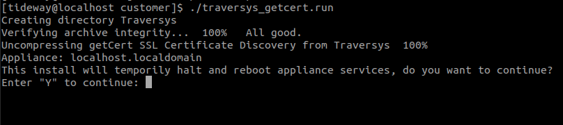
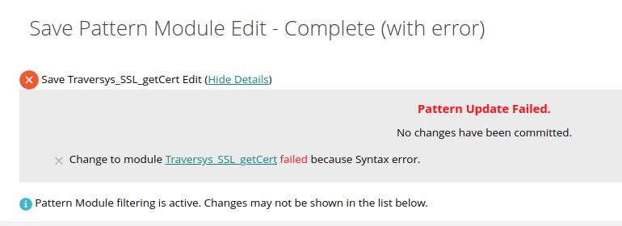
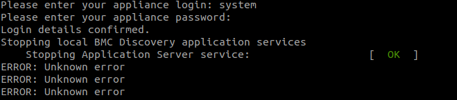
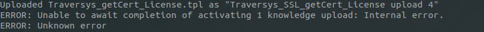

# getCert 1.7.0 for BMC Discovery

- TOC
{:toc}

## License Key Information
If you have purchased a license key and have any questions, you can contact us for support using the details above, with your licensed email address.

## Tested Versions
getCert 1.7.0 has been tested on the following versions of BMC Discovery (RHEL/CentOS). Other versions may be compatible but have not been tested.

* 11.3
* 12.x

# Release Notes

| Version | Name | Known Issues | Enchancements |
| :-----: | ---- | ------------ | ------------- |
| 1.1.0   | Alpha release | | |
| 1.2.0   | Beta release | | Added security cipher capture, artificial aging.<br>Updated method of creating a unique key.<br>Capturing subject and issuer details.<br>Added multiple port handling. |
| 1.3.0   | Beta | | Updated ciphers and timeout functions. | | Using older version of NMAP to maintain compatibility with ADDM v10.x |
| 1.4.0   | Beta | | Updated config file using ConfigParser. Replaces the ssl_capture shell script. |
| 1.5.0   | Free/Licensed | | Added license key capability for 100 certificate limit.<br>Added removal groups, new method to capture serial number and other details. |
| 1.6.0   | Community Edition | Web App Ports missing a total count<br>Wrong binary name in cron.sh script<br>No handling of IPv6 Addresses | Removed licensing requirements for Open Source Edition. |
| 1.7.0 CE | ED-209 | IPv6 addresses not currently supported<br>Device > Certificate mappings not synced to CMDB | Updated attributes to match BMC TKU certificate details.<br>Migrated to SofwareInstance link. Will generate new SI if missing.<br>Implemented external events plus data source lookup.<br>getCert now runs out of a Docker container or as a standalone script. |

## Archive Links

- [getCert 1.6 Documentation](archive/1_6_0.md)

# Overview

Traversys getCert is an extension to BMC Discovery. It operates independently of Discovery scans in either a Docker container or a standalone script. getCert non-invasively collect information about externally facing SSL certificates (accessible via open web/application ports) against your data center infrastructure.

getCet triggers an event to Discovery via the API which contains a temporary key to unlock the encrypted capture data stored with the getCert application files. The getCert pattern module will then trigger on the event and scan the getCert data source to retrieve and build a list of certificate Detail nodes. If any SoftwareInstances match the certificate IP or common name and port getCert will automatically attempt to map the Detail to the SI, alternatively, for other network devices - getCert will map directly to the device node.

getCert comes with a beta CMDB sync pattern which follows the schema of BMC's TLS Certificate OOTB mappings - and will sync any SSL Certificate details mapped directly to a SoftwareInstance to BMC_Document.

getCert is highly configurable, with the option to scan subnets, websites, DNS hostnames or IP addresses, and the discovered data can be added to the model in different ways with custom extensions.

# Installation

## Dependencies

getCert does not require any external dependencies as it will use the same packages and libraries of the host Discovery Appliance RHEL or CentOS system.

getCert is developed and tested on a dockerised CentOS 7 instance, as well as BMC Discovery 12.3 appliance. If you use the standalone script to deploy getCert to another type of stand-alone server, you will need to ensure that it is a Linux-based system which has the same kernel runtime liberaries and version of GCC.

## Installation Steps

### Container Install

You must follow these steps even if you intend to use standalone.

1. Install and configure Docker
2. Run `docker build --tag getcert --progress=plain -f dockerbuild/Dockerfile .`
3. Make a note of the password generated by the build script\
   
4. Startup the Container
 ```console
docker run -t -d -p 2222:22 --name getCert -v ${PWD}:/opt/Traversys/getCert getcert:latest
```

For the standalone installation jump to [Standalone Deployment](#standalone-deployment)

### Setup Data Source and Event Source
1. For local access, run `docker inspect getCert | grep 'IPAddress'`
2. Test SSH from local host: `ssh getcert@<docker container IP>`
3. Test SSH from outside host: `ssh getcert@<host ip address> -p 2222`
4. In BMC Discovery, create a Data Source with the following details

| Attribute   | Detail |
| ----------- | ------ |
| Name        | getCert
| Type        | SSH
| Description | Credentials for connecting to getCert docker instance
| Endpoint    | The host IP where getCert docker is hosted
| Username    | getcert
| Password    | Password provided by the build script output
| SSH Port    | 2222 (must be configured in Discovery Configuration)

5. In Discovery administration, create an Event Source with the following details
6. Create an API user with the following permissions: admin, api-access, public
7. Generate the API token and save this for later

| Attribute   | Detail |
| ----------- | ------ |
| Name        | getCert
| Description | Collects events from discovered getCert

### getCert Docker Installation

In order for getCert to run, an installation script has been provided to finalise configuration.

1. Access the shell: `docker exec -it getCert /bin/bash`
2. Navigate to `/opt/Traversys/getCert`
3. Run the installation script `python3 install.py`
4. You will be prompted to enter the URL or IP address of Discovery
5. You will be prompted to enter the API token for this Discovery target
6. Wait for the script to do it's updates and complete
7. getCert is now ready to be called by the cronjob

For Dashboards installation jump to [Dashboard Installtion](#dashboard-installation)

## Standalone Deployment

### Preparation

In order to run getCert as a standalone instance outside of docker, you will need to run the build script to generate and installation file.

1. Access the shell: `docker exec -it getCert /bin/bash`
2. Navigate to `/opt/Traversys/getCert/standalone`
3. Run the build script `python3 build.py`
4. When the script has finished copy the `traversys_getcert.run` binary to the target system (e.g. Discovery Appliance `/usr/tideway/data/customer`)
5. On the target system change permissions `chmod +x traversys_getcert.run`

### Installation on a Discovery Appliance

1. If you are installing for the first time on a Discovery Appliance, run the installation file with `install` and `dashboards` flags
   - `./traversys_getcert.run -- --install --dashboards`
2. You will be prompted to enter the URL or IP address of Discovery
3. You will be prompted to enter the API token for this Discovery target
6. Wait for the script to do it's updates and complete
7. getCert is now ready to be called by the cronjob

### Installation on a Linux System

1. If you are installing for the first time, run the installation file with `install` flag
   - `./traversys_getcert.run -- --install`
2. You will be prompted to enter the URL or IP address of Discovery
3. You will be prompted to enter the API token for this Discovery target
4. Wait for the script to do it's updates and complete
5. You will need to configure the cronjob seperately e.g.
   - `0 18 * * * <install directory>/getcert -a <discovery URL or IP> -c <config_directory>/config.ini`

## Dashboard Installation

If you want to install dashboards on a Discovery Appliance for use with the getCert Docker instance follow these steps:

1. Follow steps to [prepare the build file](#preparation)
2. Run the installation file with `dashboards` flag
   - `./traversys_getcert.run -- --dashboards`
3. The installation script displays a warning that it will restart the application service. In order to continue, type **"Y"**
   
4. Wait for the script to do it's updates and complete

## Installed Pattern Modules

| Pattern Module    | Summary |
| ----------------- | ------- |
| traversys_getCert | This is the main pattern module that triggers on an event sent from getCert
| traversys_getCert_funcs | This contains functions associated with the getCert pattern module
| traversys_getCert_CMDB_SI | This pattern contains the syncmappings that sync SSL Certificates discovered by getCert to the CMDB

You are free to browse the contents of these TPL files to see how they work. You are also free to create your own custom patterns to replace them as necessary.

## First Run

When getCert is run for the first time, a new directory (default: `/temp`) will be created with the captured data stored inside.

1. `ips` - Contains the list of IPs generated from the input
2. `ssl-out.gpg` - an encrypted file of certificate data which can only be accessed via the token passed to the event and used by the getCert pattern.

You can backup these files manually, they will be overwritten upon the next certificate scan.

## Run getCert Manually

To run getCert manually, you can trigger a certificate scan in the following way:

```console
$ screen
$ python3 getcert.py --instance <Discovery URL or IP>
```

This will assume you are running from the root getCert directy with contains the config.ini file. If you are running from another directory, you can specify the config.ini location:

```console
$ screen
$ python3 /opt/Traversys/getCert/getcert.py --instance <Discovery URL or IP> --config /opt/Traversys/getCert/config.ini
```

**WARNING** SSL Certificate discovery can be intensive, especially on large subnets, the scan may take a while to complete.

# Configuration

## Default Configuration

You can set configuration options in the config.ini file in the root directory of getCert. By default getCert is configured to:

- Run every day at 6 PM - this can be configured in `/etc/crontab`
- Scan using the `testsubnet` parameter (mode=1)
- Send an event on completion of the scan to the Discovery target and API token specified in the install script
  - These are stored in environment variables in `/opt/Traversys/getCert/lib/.env`

## Scan Modes

getCert will commence in the background and export details to an encrypted data file.

There are 3 modes you can use and are set in the config file:

1. Scan for SSL Certificates on the test ips/subnet string
2. Scan for a list of ips/subnets in the specified input file
3. Run the query (appliance login needed) to export a list of ips/subnets

## The Config File

```ini
[ENV]
root = /opt/Traversys/getCert
temp = %(root)s/temp
iplist = %(temp)s/ips
logs = %(root)s/logs

[MODE]
mode = 1

[TEST_SUBNET]
testsubnet = 192.168.1.0/24

[LIST_OF_IPS]
file = sample_input.txt

[DISCO_QUERY]
query = search DiscoveryAccess where _last_marker show endpoint

[TIMEOUT]
timeout = 3m

[PORTS]
ports = 261,443,448,465,563,587,614,636,989,990,992,993,994,995,2083,2087,2089,2096,2222,8443,8080,8880
```
### Configuration Options

The following table details the configuration for environment.

| Parameters | Description |
| ---------- | ----------- |
| root       | This is the root path of the getCert application files.<br>If you move the directory you must change this path. |
| temp       | This is the temporary directory that capture files are stored in. |
| ip list    | This is the temporary list of IPs curated from the input option. |

The following table details the configuration options.

| Option      | Parameters | Description |
| :---------: | ---------- | ----------- |
| MODE        | mode       | This is the mode that getCert will use for scanning. There are 3 options:<br>1 - Use the test subnet specified in the config file<br>2 - Use an input file<br>3 - Run a query to extract a list of targets from Discovery.<br>You can supply individual IP addresses, subnets (using CIDR syntax), websites or hostnames (if DNS is configured). |
| TEST_SUBNET | testsubnet | This is an option for testing getCert - you can input any endpoint here. |
| LIST_OF_IPS | file       | This is the name of the input file where you can specify a list of IPs, subnets, host or domain names.<br>The following syntax examples can be used:<br>192.168.1.100><br>192.168.1.1-100<br>192.168.1.0/28 |
| DISCO_QUERY | query     | Here you can specify a query to be run in Discovery. You must ensure that the query outputs only a list of IPs, subnets or hostnames and no other attributes.<br>This option requires the Discovery login user to be set. |
| TIMEOUT    | timteout   | This is the timeout for an individual endpoint during certificate scan.<br>Some devices can take a long time to respond - particularly if scanning many ports, therefore you can tweak this to improve performance.<br>A lower timeout will result in less successful discovery, a higher timeout will be more successful but take longer to complete.<br>Options are:<br>__ms__ = milliseconds<br>__s__ = seconds<br>__m__ = minues<br>__h__ = hours
| PORTS      | ports      | Here you can configure the port numbers that you want to use for discovering certificates on.<br>The default list contains the numbers of common, industry-wide and recognised standard SSL ports.<br>It is not recommended to scan every port for every endpoint as it would take a very long time to complete and likely timeout before every port was checked.<br>If you have non-standard custom ports, you can add them here using comma separated syntax.

# Viewing Results

In order to discover SSL certificates, you need to have at least run getCert once with a successful event and pattern trigger, and generated the necessary temp directory and capture files.

## SSL Certificates Dashboard

The dashboard is installed automatically and can be found under the Dashboards dropdown icon in the user toolbar.


# Security

getCert is an extension for BMC Discovery, designed to run independently of Discovery but tightly integrated via API for population the Discovery datastore with certificate data.

getCert does not require login to endpoints or devices, and is scanning standard ports which would ordinarily present an SSL certificate to an internet browser or application on GET or POST request.

Data gathered from SSL Certificate scanning is encrypted with CAST-128 (CAST5). A new key is generated for every scan and this is sent with the event data via API for one time use/data source scan.

## The Docker Container

All installation files are designed to be deployed and contained within the Docker container. By default Docker images run as root and rely on local host security. The Docker instance runs an sshd daemon which only accepts login from a pre-configured user 'getcert' and autogenerated SSH password. This can be configured manually to a different user.

getCert stores the Discovery API token in an environment variable inside the Docker container that is only available to the container itself. The environment variables are located in `<install dir>/lib/.env`. This is only used for HTTPS READ operations and is not transimitted or stored anywhere else.

## Standalone Installation

All installation files are designed to be deployed and contained within the Discovery Appliance, and therefore benefit from the standard OS level security of the Discovery Appliance.

getCert stores the Discovery API token in an environment variable on the local host in `<install dir>/lib/.env`. This is only used for HTTPS READ operations and is not transimitted or stored anywhere else.

_All UI user logins (including the `system` user) can be reset at the command line (logged in as the `tideway` user) using `tw_passwd` command. Therefore the risk of storing login details in `config.ini` is minimal - since any login can be exploited after `tideway` user access is gained._

_The `tideway` user should always be treated as a `root` user_

# Removal

The following steps detail how to remove getCert from a Discovery Appliance.

## Installed Files

### Appliance Command Line

| Directory | Files |
| --------- | ----- |
| `<root directory>/Traversys/getCert/` | All files and subdirectories
| `/usr/tideway/data/custom/reports/`| traversys_00_reports.xml
| `/usr/tideway/etc/cron/` | traversys_getCert.cron
| `/usr/tideway/etc/dashboards/` | traversys_getCert.dash

### Appliance Knowledge Management

 - Traversys
   - getCert
     - getCert
     - traversys_getCert_funcs
     - traversys_getCert_CMDB_SI

### Appliance Dashboards

 - SSL Certificates (getCert)

You can remove all files within the getCert root directory, optionally after taking a backup.

# Troubleshooting

## Missing Installation Files

If at any time installed files are accidentally deleted or removed, getCert can be reinstalled using the installation script without losing inferred SSL Certificate Details, using the following steps:

1. If necessary, backup your config.ini, cron and input files:
```console
$ cd ./Traversys/getCert
$ cp -pv config.ini config.bkup
```
2. From the original binary location, run the command as follows:
```console
$ ./traversys_getcert.run -- --replace
```
3. Follow the prompts and enter your system/admin user login details.
4. Restore your `config.ini`, cron and input files:
```console
$ cp -pv config.bkup config.ini
```

## Pattern Update Failed

You most likely have attempted to modify the getCert main pattern, but have not removed dependencies to config and license patterns.



Review the pattern module and remove all imports from getCert_Config and getCert_License and try activating again.

## Installation Error

If you get this type of error or similar during installation, it may be because another pattern operation was in progress, or appliance resources were over-capacity.



You can check Knowledge Management, and if the patterns have not loaded, delete any getCert patterns and run the installation script again after resolving any other issues that may have occurred first.

## Knowledge Upload Error



If you happen to receive this error then it's possible another TPL reasoning action is taking place during install. Wait for reasoning operations to finish, then try reinstalling again.
It can also occur when re-installing getCert over an older installation. Wait for the installation to finish and check the Knowledge Uploads. If the TPL has loaded correctly then you may not require further action.

If you are unable to verify the completeness of the install, you may need to delete all TPL files associated with getCert and run the installation again.

This may also be experienced if running on an appliance with low resources, such as a Proof-of-Concept.

---
(c) Traverysys Limited 2017-2021.\
71-75 Shelton Street, Covent Garden, London, WC2H 9JQ